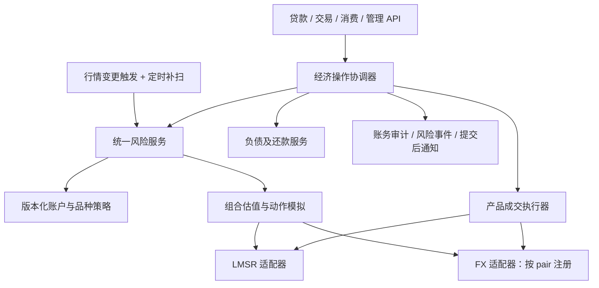

# LMSR 与多外汇统一贷款、估值及强平设计

日期：2026-09-29。状态：待用户审阅的设计稿，尚未授权实现或生产启用。

相关材料：[参数准备](../../fx-margin-preparation.md)、[FX 现货设计](2026-09-28-fx-market-design.md)、[估值口径](../../holdings-value-semantics.md)。本稿提出的新规则仅在统一风控切换后生效，不能提前混入现有现货接口。

## 1. 目标、已确认意图和本稿选择

用户希望统一贷款、净值和强平基础能力，兼容既有 LMSR 与未来多个金圆券计价外汇池，例如金圆券—摩拉、金圆券—龙门币。两类产品保留独立定价与持仓语义，共享清晰的经济和风险契约。目标规模为 50–100 人，每人初始 500 金圆券；FX 希望最高 20 倍名义杠杆，摩拉初价 0.2 金圆券。

本稿选择**统一金圆券信用账户、跨产品抵押、分来源负债、产品估值/成交适配器**。这是对上一轮方向的具体化：同一用户的 LMSR 与所有 FX 持仓共同承担账户债务，因此 FX 损失可能导致 LMSR 减仓，反之亦然。用户界面须明确提示此行为。文档审阅需特别确认这一风险归属；若希望风险互不影响，应改为独立保证金域，而不是悄悄在统一账户中实现部分隔离。

比较过的方案：

| 方案 | 优点 | 代价/结论 |
| --- | --- | --- |
| 独立 FX 保证金子账 | 限制跨产品传染，FX 独立校准 | 抵押品不能自由共享；作为未来账户模式，首版不实现 |
| 统一账户 + 产品适配器 | 一个现金余额、一套贷款与风险视图，支持多 FX | 需全链路防止抵押品被重复消费；本稿选择 |
| 把 FX 塞进 LMSR 表和 writer 数学 | 表面上统一调用 | 数学、持仓单位、市场生命周期不相容，不采用 |

本期仅做借金圆券持有 LMSR 份额/外币现货的多头杠杆。没有裸卖空、外币借贷、永续合约、资金费率、外币直兑或相关性抵扣。多个 FX pair 从首版的数据模型、风控与测试开始支持，不能再次写死单 pair。

## 2. 既有行为与需要修正的口头方案

- 现有借款额度 `max(0, k * (cash - debt + LCV) - debt)` 位于 `loan_service.py:220`，k 为债务/权益上限。500 本金、10,000 总仓位对应 9,500 债务，即 k=19；新 FX 的 20x 参数不得直接写进旧 k。
- 现有强平使用 `净值 / debt`；默认 hard=0.2、emergency=0.05、扫描 600 秒。以上是种子默认值，不是本次读取的线上配置。新 policy 不沿用这些数值和分母。
- FX 现有有债禁买、不计抵押，强平只处理 LMSR；统一模式必须同时替换这些规则，不能先打开借款再补强平。
- LMSR writer 的强平是逐市场事务，不是账户全仓一个事务。FX 通过 pair 行锁成交。适配器不能通过先锁用户再调用公开成交接口拼接事务。
- 撤回此前 `borrowable = collateral / initial_margin_rate - debt` 的通用公式：借出金圆券会增加现金与债务，但不增加权益；随后买入会改变池价、费用及风险要求。必须模拟完整动作后的状态。
- “优先卖出改善权益最多的资产”不精确：卖出再还债主要降低风险要求，并不会创造权益。清算优化目标应是改善维持保证金缺口，同时控制执行损失。
- 统一锁序不能仅改成 user-first：现有 pair-first 交易和 writer 排队会形成反向等待。第 8 节给出可落地的一致性方案。

## 3. 模块边界



建议代码边界为 `services/credit/`（负债和利息）、`services/risk/`（快照、策略、检查、强平编排）、现有 LMSR/FX 产品模块（数学和实际变更）。不把所有经济规则塞入 `wealth.py`，不复制两套 loan/sweep/audit 服务。

适配器提供数据型接口：

```python
InstrumentKey = tuple[str, int]  # ("lmsr", market_id) / ("fx", pair_id)

snapshot(instrument_key) -> InstrumentSnapshot  # 版本、状态、储备/份额
value_group(snapshot, holdings, fee_policy) -> GroupValuation
simulate(snapshot, holdings, action) -> SimulatedAction
execute_locked(tx, snapshot, action, operation_id) -> ExecutionResult
```

`value_group` 对同一池/市场的组合整体报价；`simulate` 为纯函数，不改数据库；`execute_locked` 只改调用者的事务，不自行 commit、不发送 SSE、不递归调用 API、不提交另一个 writer 命令。执行结果包含 cash/holding/debt/fee 增量、前后市场版本、实际回收、审计引用。经济协调器拥有事务边界。

## 4. 数据模型与唯一权威

### 4.1 资产与账户

- 保留 `User.cash` 为唯一可记账金圆券余额。所有花费均在用户行锁内执行；API 另算 `spendable_cash`，不能把账面现金等同可消费额度。
- 保留 `Position` 和 `FxWallet(user_id, pair_id)`；它们各自只存一种产品的资产。FX 钱包增加数量/成本非负约束，保留用户—pair 唯一约束。
- 新增 `CreditAccount(user_id UNIQUE, policy_version, state, risk_version)`；state 为 active/restricted/liquidating/insolvent。此表是风险元数据，不另存一份现金。
- 风控所有品种使用 `(product, instrument_id)`，禁止只用整数 ID。每一外币代码唯一，一种外币首版只对应一个金圆券池；龙门币初价等参数由管理员独立配置。

### 4.2 负债

新增 `CreditLiability`：id、user_id、currency=GOLD、source、origin_instrument（可空）、principal、interest_due、rate_policy_version、last_accrued_at、status。source 标识 legacy_loan/cash_loan/margin_purchase，**不决定抵押归属**；统一账户的全部合资格资产担保全部有效负债。

新增 `CreditEntry` 为不可变增量流水：operation_id、liability_id、kind、principal_delta、interest_delta、cash_delta、余额快照、时间、操作者。唯一业务键防止借款、计息、还款和补偿重复入账。每次增量与资产变更在同一事务内提交，同时写入现有审计体系，不制造独立不对账的第二本现金账。

迁移完成后 `D = sum(principal + interest_due)` 是债务唯一权威。`User.debt` 暂留为兼容投影，由 CreditService 在同事务更新；禁止旧服务继续直接写它。`User.debt_last_accrued_at` 不再驱动计息。所有旧 API、管理免债、大赦、兑换守卫、赛季重置必须接入 CreditService，检测任何投影不一致并阻止进一步增险。

### 4.3 策略、清算与坏账

- `RiskPolicyVersion` 保存不可变账户政策快照；`InstrumentRiskPolicy` 保存品种准入、初始/维持保证金、上限、压力情景、数据有效期。事件与快照记录实际使用的版本。
- `LiquidationRun` 记录账户触发原因、输入快照、策略版本、状态与前后缺口；`LiquidationAction` 记录每个原子动作、重试、实际回款及还款、失败原因。旧 `LiquidationEvent` 仅为兼容展示投影。
- `RiskReserve` / `RiskReserveEntry` 记录专用金圆券风险准备金和管理员明确发行/注资；`BadDebtEvent` 记录核销、准备金支付与未覆盖损失。不得默认从 FX 做市 treasury 扣保险资金。
- `RiskDirty` 和提交后事件 outbox 持久化待重估用户/品种及版本，防止进程在交易提交后、通知前崩溃丢失强平触发。

## 5. 三种估值与组合计算

设 C 为金圆券现金，D 为含应计利息债务，V 为所有资产展示 MTM，L 为组合净清算回收值，S 为压力情景下清算值：

```text
display_equity = C + V - D
risk_equity E  = C + L - D
stress_equity(scenario) = C + S(scenario) - D
```

MTM 用于资产页和排行榜；L 用于风控；S 用于授信压力闸和后台压力报告。所有接口返回明确口径、计算时间、品种版本与缺失/暂停原因，不再用一个模糊的 net_worth 覆盖所有场景。

### 5.1 组合 LCV

- FX：按 pair 聚合该用户全部摩拉/龙门币，执行一次模拟 `quote_sell`，扣当前适用清算费用与量化；不能把同一池多笔持仓分别按原储备报价相加。
- LMSR：按 market 聚合 outcome 持仓，从同一 q 向量移除整个持仓向量，或在本地副本按固定 outcome 顺序依次报价并更新 q；费用按对应规则逐笔计算。不能把每个 outcome 在原 q 上独立全卖的收益相加，避免重复计算流动性。
- 独立 FX 池和 LMSR 市场的组合回收值可以相加；这是单用户在当前状态下的 LCV，不保证全体用户同时可按同一价格退出。每次清算后必须重估其他受影响用户。
- 暂停资产展示仍有 MTM，但可执行 LCV 为 0；已结算的确定性应收只能在适配器确认可立即兑付时按净应收计入。数据缺失或过期时禁止新增信用和风险提取，不用缓存价格冒充可执行报价。
- 风险估值中的费用必须至少覆盖实际强平收费，避免判定有保障但执行被额外费用击穿。所有现金/数量使用 Decimal；沿用产品精度，风险回收向下、费用与风险要求向上量化。

### 5.2 压力场景

FX 压力测试在池状态副本中通过模拟交易施加不利价格变动，随后再卖出持仓，不直接把边际价乘折扣伪装成 AMM 回收。LMSR 使用明确的 q/b 情景；首版不假设相关性抵扣。全市场同向平仓必须顺序更新各池，不把每人的原始 LCV 相加。

隐藏目标价不作为 FX 抵押估值或标记价格；它既不可直接成交，也可能受管理员事件调整。系统噪声/干预和玩家交易具有相同的风险触发义务。

## 6. 授信和保证金公式

对每个风险组 i，`N_i` 是当前持仓金圆券 MTM 敞口（只做多，不跨品种净额抵扣），`m_i` 为初始保证金率，`u_i` 为维持率。以净清算权益 E 作为保守比较基础：

```text
IM = max(sum(m_i * N_i), D / (L_account - 1)) + B_initial
MM = max(sum(u_i * N_i), beta * D) + B_maintenance
TM = MM + restore_buffer

增险准入：E_after >= IM_after 且压力闸通过且所有限额满足
强平触发：D > 0 且 E < MM
恢复目标：E >= TM，或 D == 0
```

要求 `0 < u_i < m_i <= 1`，`L_account > 1`，`0 <= beta < 1/(L_account-1)`；B、restore_buffer 均非负。beta 是独立的债务维持底线，用于现金借款也受约束，不能把它和旧 emergency 阈值混用。纯现货、无债账户不因保证金要求而被强制卖出。B 用于绝对费用/执行缓冲，不能与 L 中已计费用重复记账。

FX 品种若配置 `m_i=0.05`，只表示最高 20x 名义杠杆门槛；手续费、AMM 回收折损和 B 会使 500 保证金实际能开的仓位低于 10,000。不保证“500 一定开满 10,000”。LMSR 可设更高 m/u，多品种组合按加总要求约束，不能借低风险货币对额度转买高风险 LMSR。

`L_account` 同时约束借现金不交易的行为，防止 C 与 D 同增导致借款额度无限循环。全账户与每品种还有绝对名义敞口、用户持仓/池深比例、全体敞口/池深比例和新增信用发行上限。多 pair 的默认配置可继承，但每个 pair 的实际策略均有独立版本。

本稿不把普通事件 2%–5%、黑天鹅 8%–12% 和 20x 宣称为安全组合。高杠杆最大损失可能超过权益，维持率、压力闸与准备金金额必须由第 12 节模拟校准后形成可加载的策略版本；生产没有经过校准的策略时统一增信闸必须关闭。这是上线验收条件，不允许实现者随意填常数。

### 6.1 借款、买入和现金提取

- `borrow_cash(x)`：在锁内计息，模拟 C+x、D+x，按完整后态校验上述公式和信用上限；通过后同时发行虚拟现金与债务，明确记录 credit_issuance 来源。本项目贷款是有审计的站内信用发行，不伪装为某个 treasury 转账。
- `buy_with_credit(action, x)`：一个事务内完成新增债务、对应现金、实际产品买入及后态风险复检，失败全部回滚。报价使用模拟成交后的池状态与持仓，防止自买抬高 MTM 后重复借款。
- `quote_credit(action)` 返回指定动作允许的最大信用、费用和后态风险，只作预估。纯现金借款可解析求界；AMM 数量搜索仅在证明风险函数于指定区间单调时使用二分，否则使用保守有界搜索并返回已验证的下界。执行必须锁内重算，不承诺预报价。
- 所有消费、兑换、赠送、管理员扣款、其他产品买入，均走账户现金提取/后态风险检查；正常减仓和还款不能被增险闸误拦。现有兑换“有债禁用”首版继续保留，并改读总债务。
- 增险操作、借款或提现被 `liquidating/insolvent` 状态阻止。用户可充值、还款以及提交不恶化风险的减仓；该减仓在同事务将所得优先还债。
- `spendable_cash` 定义为在全部准入与既有消费守卫下可安全扣出的最大金额，永远不大于 C。不得靠前端禁用按钮维护此约束。

### 6.2 利息与还款

复用现有按经过时间复利的纯数学函数，但按 liability 的利率版本与时间戳分别计算；估值包含未落库应计利息，写操作先计息再执行。舍入为零时不推进计息基准，避免灰尘债逃息。

默认按利率从高到低、创建时间、id 的稳定顺序还款，每条先息后本；固定时间点重复请求幂等。用户还款与强平还款均以锁后实际 C/D 封顶。管理免债也必须产生同样可重放流水，不能只覆盖 User.debt。

## 7. 强平编排与执行

### 7.1 触发和状态机

交易、系统干预、事件、利息、费用/风险策略变化、池子注撤资及市场状态变化均在提交事务中写入 dirty/outbox。以品种反查全部有债持仓用户，合并相同版本触发。另每秒执行一次有界补扫，重启从数据库恢复未完成任务；扫描间隔和批量大小可配置，不能沿用 600 秒默认值作为 20x 保障。

账户和 run 状态：healthy → restricted/liquidating → healthy 或 insolvent。每用户最多一个有效 run，通过数据库唯一约束和操作键保证，不只依靠进程字典。任务失败保留 checkpoint 和具体原因；不因一次没有成交就冷却 30 分钟。

### 7.2 清算动作

1. 在一致快照下计息、计算 E/MM；已恢复则结束过期任务。
2. 优先用已有现金还债，提交前重新计算后态。
3. 对可交易风险组生成有界候选减仓数量，包括部分卖出和全部卖出；每个候选在市场副本中模拟成交、费用、还债及后态 E/MM。
4. 优先改善 `E - MM` 的动作；同等改善下选择执行损失较低的动作，再以 InstrumentKey 稳定排序。不能假设所有曲线上的局部最优动作都能一次恢复健康。
5. 每次只提交一个产品动作：卖出、持仓变更、回款还债、负债投影、审计及 action checkpoint 同事务完成。不同市场不持有长事务跨 writer 等待。
6. 提交后更新市场镜像并通知受影响账户；下一动作重新生成风险快照。达到 TM 或债务为零就停止，避免无必要地继续卖仓。
7. E<=0 或常规动作无法恢复且风险继续恶化时进入 emergency，允许完整清算可交易资产；仍记录每个动作的实际回收与理由。剩余不能执行的资产进入 blocked/retry，不声称已清仓。

### 7.3 滑点、暂停和系统预算

不沿用用户历史 min_out 约束强平。每个动作使用本次版本化快照产生系统最低回收金额，版本变化就重新报价；常规阶段通过分批大小控制冲击。紧急阶段可按策略升级全卖，不设置一个永久禁止减仓的硬滑点阈值。没有正回收/储备无效时不交易，记录 blocked 并继续处理其他资产。

区分 `open`、`reduce_only`、`halted`、`closed`：reduce_only 可还款和强平；halted 完全不能成交，LCV=0，但不豁免整个账户的其他资产。FX 人工干预暂停、玩家开仓暂停、风险减仓暂停是不同开关。若市场无法安全执行，不绕过 halted 强改池子。

强平使用用户持仓与成交池，不受系统噪声/干预的 daily_budget 控制。池子撤资要先做有债账户压力检查，禁止在有敞口时撤出关键流动性导致无法清算；管理员紧急覆盖必须明确记录受影响账户和处理方案。

## 8. 并发、一致快照与 writer 兼容

### 8.1 首版采用串行经济准入

当前应用的单进程 writer 和 50–100 人规模允许优先采用一个共享 `EconomicCoordinator`：覆盖所有现金/债务/持仓/池价/市场状态变更，估值和验证期间禁止另一经济写操作穿插。这是短操作串行，不是把整轮多账户强平或全部读请求串行。

锁/排队纪律如下：

```text
请求进入队列（不持 DB 锁）
→ writer consumer 或普通执行入口取得共享经济协调锁
→ 获取本次稳定快照并执行风险模拟
→ DB 事务内按固定顺序取产品行锁 → 用户/信用账户 → 持仓 → treasury → liability
→ 写入全部经济变更、审计、outbox
→ commit
→ 更新/重载 writer 缓存镜像
→ 释放协调锁
```

产品行按 `(product, id)` 排序，多行持仓/负债按 id 排序。LMSR 已排队命令在 consumer 内、读取用于报价的 state 之前取得协调锁；FX、loan、admin、settlement、PvE 和所有 sweep 使用同一入口。禁止先取 User 锁再等待 writer；协调器内部只调用无 commit 的执行器，不再次排队自身。数据库锁统一使用刷新语义避免 ORM 旧对象覆盖新值。

统一模式首版强制单个经济写进程：启动时使用数据库 session advisory lease 防止第二个经济写进程启动，不支持多 worker/多副本绕过；租约丢失即停止写入。已有只读实例可独立存在。该租约保护进程所有权，进程内协调锁保护动作串行。SQLite 测试替身不能证明 PostgreSQL 锁正确。

缓存变更必须在 commit 后、释放协调锁前完成。失败则持锁重载受影响市场；重载失败标记该市场不可增险并停止其 writer，不能继续以旧镜像交易。数据库是恢复权威。

### 8.2 性能与演进界限

不要求所有写操作持有所有市场行锁；共享准入确保快照到提交期间没有合法经济写入。估值可以在锁外批量预筛，但锁内重验不能使用过期缓存。锁内禁止网络请求、等待其他队列、SSE 推送或长时间全场压力模拟。

验收需测量 100 用户并发、系统 tick 和强平同时发生时的队列等待、P95 成交时延、最老 dirty 延迟、清算追赶速度。若无法满足启用的风险策略所需延迟预算，禁止启用 20x；后续再设计按品种门闩/版本重验优化，不能提前宣称单用户锁足以保证跨市场风险一致。

## 9. 多 FX、API 和用户界面契约

- 删除“一次只能一个 trading pair”的管理端规则；每个 pair 独立金圆券/外币池、treasury、目标价、事件预算、风险参数、版本与 dirty 索引。
- 引擎改为逐 pair 短事务/协调动作，按稳定顺序处理；一个 pair 的异常不能回滚另一 pair 的已提交交易。每个 pair 的 treasury.daily_spend 保持自身口径，另设全体系统支出总上限。
- broker、序号、限流、行情缓存和 dirty 键统一使用产品命名空间。修复裸整数 market_id/pair_id 同号混发，保留对旧客户端的可控 wire 兼容。
- 新统一账户读取返回 cash、spendable_cash、principal、interest、total_debt、MTM/LCV/stress equity、IM/MM/headroom、policy_version、风险状态和逐品种明细。贷款 quote 必须说明动作、有效版本及实际执行会重算。
- 现有 `/loan`、`/user/summary`、排行榜与管理净值接口逐步转为统一服务投影，不能在不同 API 各写一遍公式。旧字段保留原标注直到客户端迁移，新增明确字段，不静默改变 margin_ratio 分母。
- 强平公示保留公共摘要，个人详情含动作/费用/还款；后台可见完整风险快照。隐藏 FX target/shock/随机状态仍不出现在公共或个人风险响应。
- 页面需展示“统一抵押：任一产品亏损可能触发其他产品减仓”、可用消费现金与账面现金差异、每个外币的持仓和净值。验证遵循用户偏好：截图为主，不启动浏览器自动交互测试。

## 10. 穿仓与信用发行闭环

先偿还可用现金，再清算可执行抵押物；对剩余负债进入 insolvent 并冻结新增信用。拥有暂时 halted 资产的账户不能立即把所有剩余债务认定为最终损失，记录待处置抵押并恢复后继续处理。

最终坏账处理是显式、幂等事务：记录损失 → 按已批准限额使用独立风险准备金冲抵债务 → 未覆盖余额记为系统信用损失并核销对应 liability。核销前用户仍显示剩余债务，核销后保留永久 BadDebtEvent 与授信冻结，不允许既核销又把同一金额作为用户有效债务重复追索。

本稿首版不做社会化摊损，不默认挪用任一 FX treasury，不自动无限增发保险资金。准备金注资与信用损失都进入发行/核销总账；期末可以解释现金、贷款债权、准备金和累计损失的变化。

## 11. 迁移、兼容和回退

实施分为依赖明确的阶段，详细 task 列表留待本 spec 审阅后编写：

1. 修复跨产品频道隔离、建立组合估值与统一读取，保持旧贷款/强平行为。
2. 增加信用账户/负债流水，停写窗口中按统一 cutoff 结息；每用户创建唯一 legacy liability，验证 sum=D 与 User.debt 一致，重复迁移不重复发钱。迁移不改现金。
3. 路由全部经济写入口与债务改动至协调器/CreditService。对读写路径做枚举验收，不能让管理脚本、机器人或结算保留绕过通道。
4. shadow 模式用新估值和 policy 计算风险但不新增 FX 信用、不执行第二套强平；旧账户继续 legacy policy。比较快照和报警，不混用两个执行者。
5. 切换时暂停新增风险、禁用旧 sweep，再启用新 orchestrator。既有不合格账户进入 reduce_only 过渡并通知，不能仅因为改变估值口径立刻无告知清仓。过渡期间的保护时限与生效政策必须明确记录，不能永久豁免。
6. 校准并加载新 policy 后，按受控范围开放多个 FX pair 和信用，逐步评估最高 20x；切换时账户使用一个整体 policy，不能对同一抵押物同时套旧与新额度。

User.debt 兼容投影保留至所有调用者和审计工具迁移完毕再另案删除；迁移后不能回到旧债务写路径。新增表、审计类别、dirty/outbox 和准备金处理必须纳入赛季重置；历史归档策略与兑换记录保留规则保持明确。

出现问题时先停增险，保留读取/还款/安全减仓。新信用已产生后不能仅切旧代码并删新表，否则丢债务权威。数据库回退必须用匹配版本备份及迁移 runbook；legacy Git 分支仅保存源码，不是生产数据库备份。

## 12. 验收门槛

### 数学与账务

- 500 本金 20x 在零费用/无限深近似下对应 9,500 借款；实际 AMM 加费用后开仓上限下降，不能开仓即满足强平条件。
- 同市场多个 LMSR outcome 的组合 LCV 与顺序模拟一致；同 FX pair 聚合清算与真实 sell 一致；两个独立 pair 的总值不混币种。
- 借款 C/D 同增不改变权益，现金循环借款不突破债务底线；自买抬价不创造可无限循环抵押额度。
- 每次操作都满足现金、各币种、负债和发行来源可重放；借款、利息、归还、免债、坏账均不双记，User.debt 投影一致。
- 部分清算以 MM 缺口为目标，达到恢复目标停止；费用、量化、利息和 paused 资产不产生假健康。

### 并发与恢复（必须 PostgreSQL）

- 同用户 LMSR 买入/FX 买入/借款/消费并发，不能重复使用抵押或覆盖 cash。
- FX 玩家单、系统 tick、事件与强平并发，顺序与审计一致；跨 pair 和同号 market/pair 不串台。
- writer 排队与 FX 用户锁不形成循环等待；第二经济写进程启动被拒绝；镜像失败正确重载/停写。
- 崩溃点覆盖借贷提交前后、清算单动作提交后汇总前、dirty/outbox 投递前后，恢复不重复卖仓/还款。
- old/new sweep 互斥切换，migration 与 season reset 均有幂等或停服事务保护。

### 参数压力校准

使用 [准备文档](../../fx-margin-preparation.md) 的 200 万/1000 万/4000 万金池作候选；模拟 50/100 人、集中多头、两个及更多 FX、LMSR 同时下跌、2%/5%/12% 事件、暂停、撤资、费用、引擎预算耗尽和批量强平。

输出每组实际最大杠杆、开仓后缓冲、队列/强平延迟、最大穿仓、准备金消耗、池价轨迹及剩余债务。保留输入、随机种子、版本和重放结果。无这些证据不得把候选维持率或 20x 标为生产就绪。

## 13. 归档点与本次交付边界

本地归档分支 `legacy/pre-fx` 指向 `3deebf0fa3f13769ed3fc12e6eab375323b2411a`（2026-09-27 主线 PR #4 合并）。已核对该树没有 FX 模型、服务目录或玩家页面。

FX 初始功能提交为 `0d9459d`，其开发分支父提交为 `83fe1cf`；选主线 `3deebf0` 而非该父提交，是为了保留 FX 合入主线前已有的借贷和兑换修复。FX 合入主线发生在 `b7c2ea4`。分支本次仅在本地创建，未推送；它保留历史快照，不复制当前工作区、不回退当前分支。

本次只交付文档与本地归档引用。用户审阅本稿后才制定实现计划；部署与生产开闸属于后续独立动作。
